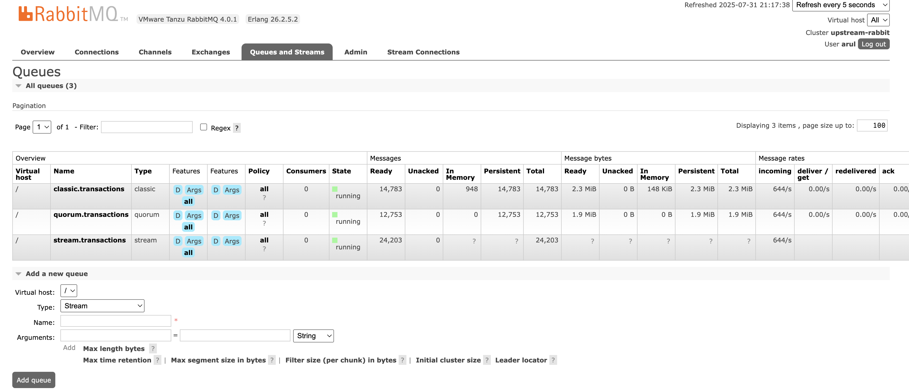

# 🐇 SpringRMQ Transaction Simulator 

Welcome to **SpringRMQ Transaction Simulator**!  
This project is a fun, interactive demo of how to use RabbitMQ exchanges, queues, publisher confirms, and Vaadin dashboards in a modern Spring Boot app.

## 🚀 What does it do?

- **Simulates banking transactions** and publishes them to a RabbitMQ **fanout exchange** called `transactions`.
- The exchange routes every transaction to **three different queues**: classic, quorum, and stream.
- **Publisher confirms** are tracked for reliability.
- **Consumers** read messages from all three queues, 10 at a time, every second, and acknowledge them.
<!-- - **Vaadin UI dashboard** shows live counters for published and confirmed messages per queue. -->


## 🛠️ How to build & run

### Prerequisites

- Java 21
- Maven
- RabbitMQ running locally (`localhost:5672`)
  - Username: `arul`
  - Password: `password`
  - [Install RabbitMQ](https://www.rabbitmq.com/download.html) if you don't have it.

### Quick Start

1. **Clone this repo**
   ```sh
   git clone https://github.com/yourusername/springrmqtransaction.git
   cd springrmqtransaction
   ```

### Rabbitmq user config 

```
rabbitmqctl add_user arul password
rabbitmqctl set_permissions -p / arul ".*" ".*" ".*"
rabbitmqctl set_user_tags arul administrator
```

## RabbitMQ Queue Policies

Example policies for queue limits and overflow handling:

```sh
rabbitmqctl set_policy q-pol "quorum.transactions" \
  '{"max-length":1000,"overflow":"reject-publish"}' \
  --apply-to queues

rabbitmqctl set_policy s-pol "stream.transactions" \
  '{"max-length":1000,"overflow":"reject-publish"}' \
  --apply-to queues

rabbitmqctl set_policy c-pol "classic.transactions" \
  '{"max-length":10000,"overflow":"reject-publish"}' \
  --apply-to queues
```


### Build and Run the Application

```
mvn clean package
```

```
mvn spring-boot:run
```
### Running multiple instances of application

```
mvn spring-boot:run -Dspring-boot.run.arguments=--server.port=8085
```



